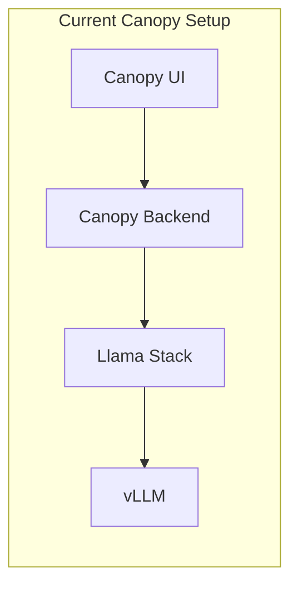
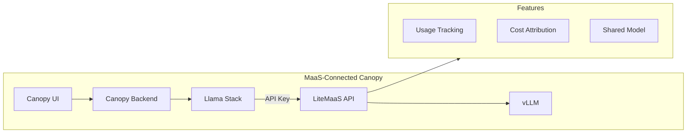

# 🌳 Canopy Integration

> 🌳 **Persona Focus: Everyone** — This is the moment where it all comes together! Canopy has been talking directly to your model endpoint. Time to upgrade it to use MaaS.


## 🎬 The Before & After

Let's visualize what we're changing:

### Before



### After



Now Canopy goes through LiteMaaS, which provides:
* ✅ Centralized usage tracking
* ✅ Cost attribution
* ✅ API key management
* ✅ Shared model access

---

## 🔐 Step 1: Create an API Key for Canopy

First, let's create a dedicated API key for Canopy experiments.

### Why a Dedicated Key?

| Approach | Problem |
|----------|---------|
| Use personal key | Can't distinguish Canopy usage from your experiments |
| Share key with team | Who's using what? No accountability |
| **Dedicated app key** | ✅ Clean tracking, easy rotation, specific budget |

1. First, under `Models`, let's subscribe to `Llama-3.2-3B-Instruct-FP8` model. Click it and then hit `Subscribe`

  

2. After you successfully subscribed, move to `API Keys` and create an API key for the model you just subscribed!

  Give the API key a name like `canopy-experiments`, and a good description such as `API Key to be used in the experiment environment`.

  

  It should create a key something like `sk-abcdxxx` 

1. After copying the key, close the screen and click `View Key` to get more information about the API endpoint, and a usage example.

  If you click on `Show key`, the eye 👁️ icon on right corner, you'll seethat the usage example is updated with your key. Then copy that usage example and paste to your terminal to verify your access to the model endpoint with the generated key.

  

  


## ⚙️ Step 2: Update Canopy Configuration

Now we need to tell Llama Stack to use LiteMaaS instead of the direct endpoint.

1. From Llama Stack point of view, it's just another model endpoint that happens to be served via a gateway. Let's add this yet another model endpoint by upgrading the helm release as we've been doing. 

  In `<USER_NAME>-canopy` namespace, go to `Helm` > `Release` > `llama-stack-operator-instance` > Upgrade. In the Form view, under `models`, click `Add models` and add below info that you get from LiteMaaS:

  name: `Llama-3.2-3B-Instruct-FP8`

  url: `https://litemaas-litellm-<USER_NAME>-maas.<CLUSTER_DOMAIN>/v1`

  token: `your-token-sk-xxxx`  (copy it from LiteMaaS)

  

## 🌳 Step 3: Update Canopy Backend

Like we've done multiple times before, let's update Canopy backend configuration to use this newly added model to our Llama Stack configuration.

1. Find `canopy-backend` under **OpenShift Console** → **Helm** → **Releases** 


2.  We need to change every `llama32-fp8` into MaaS provided version of that model :) For example, for  `summarize`:

    ```yaml
    summarize:
      enabled: true
      max_tokens: 2048 
      model: vllm-Llama-3.2-3B-Instruct-FP8/Llama-3.2-3B-Instruct-FP8 # 👈 update this ❗️❗️❗️
      prompt: "<your prompt>"
    ```

3. Click **Upgrade** to apply the changes.

4. When everything is blue in Topology view, go to Canopy UI and verify everything works before we repeat this for `test` and `prod` environment, but through GitOps. 

  Here is your Canopy UI link: 

  ```bash
  https://canopy-ui-<USER_NAME>-canopy.<CLUSTER_DOMAIN>/
  ```

  Actually, before GitOps-y parts, let's quickly monitor your model usage based on this key.

---

### 📊 Step 4: Track Your Usage

As a responsible developer (and budget-conscious human), you'll want to know how much you're using. Go to Canopy UI and send more prompts, requests, and come back to the dashboard to observe the values.

  

---

## 🧪 Knowledge Check

<details>
<summary>❓ Why should each application have its own API key?</summary>

✅ **Answer:** Separate API keys provide:
- Clear usage tracking per application
- Individual budgets per application
- Easy key rotation without affecting other apps
- Ability to revoke one app's access without impacting others
</details>

<details>
<summary>❓ What's the benefit of seeing Canopy usage in LiteMaaS?</summary>

✅ **Answer:** You can now:
- Track how much Canopy costs to operate
- Compare usage across multiple applications
- Set budgets and alerts per API key
- Make data-driven decisions about scaling
- Attribute costs to specific applications and users
</details>

---

Ideally the next step should be making `test` and then `prod` environment to consume models through MaaS for all the benefits we discussed. However, as you might have already guessed, we throughly follow GitOps in these higher environments and we need to store API key `as code` as well, but you shouldn't push an API Key to git, right? What are you going to do then? 

Let's have a short divergence from MaaS and introduce Secret Management in GitOps quickly.

---